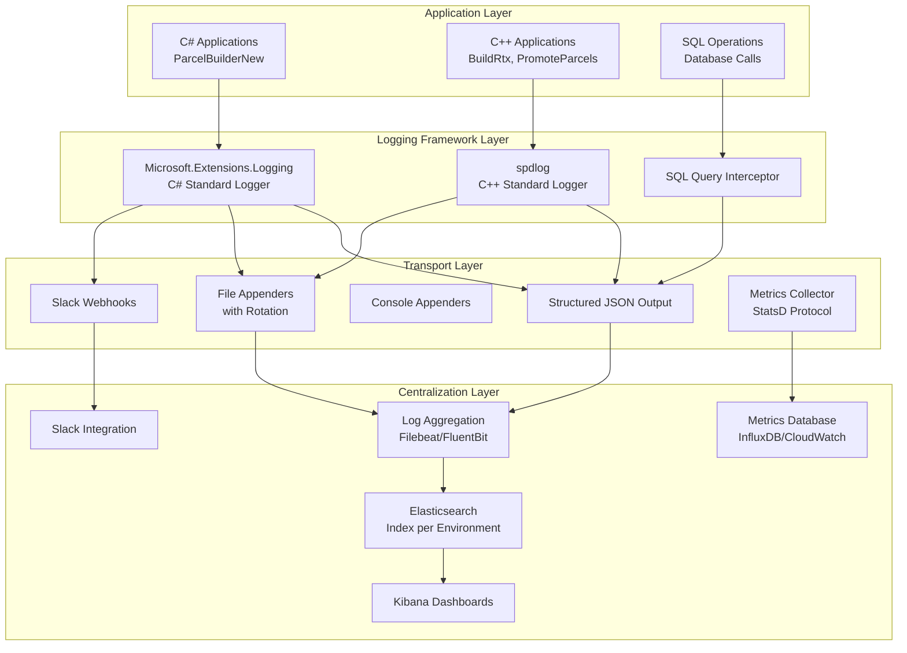

# PxPoint Enterprise Logging Architecture

## Executive Summary

This logging architecture addresses the critical observability gaps in the PxPoint pipeline identified in Phase 1. The design focuses on standardization across C#/C++ codebases, comprehensive context tracking, and operational visibility for a complex geospatial data processing pipeline.

## Current State Analysis

### Critical Issues Identified
- **Fragmented Logging**: Mix of console output, UI messages, and custom file rotation
- **Lost Context**: Missing FIPS codes, job IDs, timestamps, and stack traces
- **File Rotation Failures**: 10-file limits causing application failures
- **Cross-Language Inconsistency**: Different logging approaches in C# vs C++
- **No Centralization**: Logs scattered across multiple locations with no aggregation
- **Debugging Bottlenecks**: Insufficient visibility into multi-hour/day processing

## Architecture Overview



## Core Design Principles

### 1. **Standardization**
- Single logging framework per language (Microsoft.Extensions.Logging for C#, spdlog for C++)
- Consistent log levels, formatting, and context across all components
- Unified configuration management through `appsettings.json` and environment variables

### 2. **Rich Contextual Information**
Every log entry includes:
```json
{
  "timestamp": "2024-01-15T10:30:45.123Z",
  "level": "INFO",
  "logger": "ParcelBuilderNew.NormalizeParcels",
  "message": "Starting normalization for FIPS 06037",
  "context": {
    "fips": "06037",
    "jobId": 12345,
    "threadId": "Worker-3",
    "userId": "system",
    "buildId": "2024Q1-Build-001",
    "phase": "normalization",
    "step": "normalize"
  },
  "execution": {
    "correlationId": "abc-123-def",
    "parentSpanId": "span-456",
    "duration": 1250,
    "memoryUsage": "2.3GB"
  },
  "metadata": {
    "hostname": "pxpoint-worker-01",
    "environment": "production",
    "version": "2.1.0"
  }
}
```

### 3. **Performance Monitoring**
- Automatic timing for major operations
- SQL query performance tracking
- Memory usage monitoring
- Progress indicators for long-running operations

## Implementation Strategy

### Phase 1A: Foundation (Weeks 1-4)

#### C# Implementation
```csharp
// Standardized logger configuration
public static class PxPointLogger 
{
    public static ILogger CreateLogger<T>() 
    {
        return LoggerFactory.Create(builder =>
            builder
                .AddConsole(options => options.IncludeScopes = true)
                .AddFile("logs/pxpoint-{Date}.json", outputTemplate: JsonTemplate)
                .AddSlack(webhookUrl: Configuration["Slack:WebhookUrl"])
                .SetMinimumLevel(LogLevel.Information)
        ).CreateLogger<T>();
    }
    
    public static IDisposable BeginScope(string fips, int jobId, string operation)
    {
        return Logger.BeginScope(new Dictionary<string, object>
        {
            ["FIPS"] = fips,
            ["JobId"] = jobId,
            ["Operation"] = operation,
            ["CorrelationId"] = Guid.NewGuid().ToString()
        });
    }
}

// Usage in ParcelBuilderNew
public class ParcelBuilderMainWindow 
{
    private readonly ILogger<ParcelBuilderMainWindow> _logger = PxPointLogger.CreateLogger<ParcelBuilderMainWindow>();
    
    private async Task NormalizeParcels()
    {
        using var activity = _logger.BeginScope("normalization", 0, "normalize-parcels");
        
        try 
        {
            _logger.LogInformation("Starting parcel normalization with {ThreadCount} threads", numThreads);
            
            var stopwatch = Stopwatch.StartNew();
            // ... existing logic
            
            _logger.LogInformation("Parcel normalization completed in {Duration}ms", stopwatch.ElapsedMilliseconds);
            await SlackNotifier.SendSuccess("Parcel normalization completed", context);
        }
        catch (Exception ex)
        {
            _logger.LogError(ex, "Parcel normalization failed");
            await SlackNotifier.SendError("Parcel normalization failed", ex, context);
            throw;
        }
    }
}
```

#### C++ Implementation
```cpp
// spdlog configuration
#include <spdlog/spdlog.h>
#include <spdlog/sinks/rotating_file_sink.h>
#include <spdlog/sinks/stdout_color_sinks.h>

class PxPointLogger {
public:
    static std::shared_ptr<spdlog::logger> GetLogger(const std::string& name) {
        auto logger = spdlog::get(name);
        if (!logger) {
            auto file_sink = std::make_shared<spdlog::sinks::rotating_file_sink_mt>(
                "logs/pxpoint.log", 1024*1024*50, 10); // 50MB, 10 files
            auto console_sink = std::make_shared<spdlog::sinks::stdout_color_sink_mt>();
            
            logger = std::make_shared<spdlog::logger>(name, {file_sink, console_sink});
            logger->set_pattern("[%Y-%m-%d %H:%M:%S.%e] [%l] [%n] %v");
            spdlog::register_logger(logger);
        }
        return logger;
    }
    
    static void LogWithContext(const std::string& level, const std::string& message,
                              const std::string& fips = "", int jobId = -1) {
        auto logger = GetLogger("PxPoint");
        std::string contextual_message = fmt::format(
            "{{\"message\": \"{}\", \"fips\": \"{}\", \"jobId\": {}, \"timestamp\": \"{}\"}}",
            message, fips, jobId, GetTimestamp()
        );
        
        if (level == "info") logger->info(contextual_message);
        else if (level == "error") logger->error(contextual_message);
        else if (level == "debug") logger->debug(contextual_message);
    }
};

// Usage in PromoteParcels.exe
void ProcessParcels(const std::string& fips) {
    auto logger = PxPointLogger::GetLogger("PromoteParcels");
    
    try {
        PxPointLogger::LogWithContext("info", "Starting parcel promotion", fips);
        
        auto start = std::chrono::high_resolution_clock::now();
        // ... existing logic
        auto end = std::chrono::high_resolution_clock::now();
        auto duration = std::chrono::duration_cast<std::chrono::milliseconds>(end - start);
        
        PxPointLogger::LogWithContext("info", 
            fmt::format("Parcel promotion completed in {}ms", duration.count()), fips);
            
    } catch (const std::exception& ex) {
        PxPointLogger::LogWithContext("error", 
            fmt::format("Parcel promotion failed: {}", ex.what()), fips);
        throw;
    }
}
```

### Phase 1B: Database Integration (Weeks 2-6)

#### SQL Query Logging
```csharp
public class PxPointDbInterceptor : DbCommandInterceptor
{
    private readonly ILogger<PxPointDbInterceptor> _logger;
    
    public override ValueTask<InterceptionResult<DbDataReader>> ReaderExecutingAsync(
        DbCommand command, CommandEventData eventData, InterceptionResult<DbDataReader> result,
        CancellationToken cancellationToken = default)
    {
        var stopwatch = Stopwatch.StartNew();
        _logger.LogDebug("Executing SQL: {CommandText}", command.CommandText);
        
        return base.ReaderExecutingAsync(command, eventData, result, cancellationToken);
    }
    
    public override ValueTask<DbDataReader> ReaderExecutedAsync(
        DbCommand command, CommandExecutedEventData eventData, DbDataReader result,
        CancellationToken cancellationToken = default)
    {
        _logger.LogInformation("SQL executed in {Duration}ms: {CommandText}", 
            eventData.Duration.TotalMilliseconds, 
            TruncateQuery(command.CommandText));
            
        if (eventData.Duration.TotalMilliseconds > 5000) // Log slow queries
        {
            _logger.LogWarning("Slow SQL query detected: {Duration}ms", 
                eventData.Duration.TotalMilliseconds);
        }
        
        return base.ReaderExecutedAsync(command, eventData, result, cancellationToken);
    }
}
```

### Phase 1C: Centralized Monitoring (Weeks 4-8)

#### Slack Integration
```csharp
public static class SlackNotifier 
{
    private static readonly SlackClient _client = new SlackClient(Configuration["Slack:WebhookUrl"]);
    
    public static async Task SendProgress(string operation, string fips, int progress)
    {
        var message = new SlackMessage
        {
            Channel = "#pxpoint-builds",
            Text = $"🔄 *{operation}* - FIPS {fips}: {progress}% complete",
            Username = "PxPoint Pipeline"
        };
        await _client.PostAsync(message);
    }
    
    public static async Task SendError(string operation, Exception ex, Dictionary<string, object> context)
    {
        var contextStr = JsonSerializer.Serialize(context, new JsonSerializerOptions { WriteIndented = true });
        
        var message = new SlackMessage
        {
            Channel = "#pxpoint-alerts",
            Text = $"🚨 *Pipeline Error*\n*Operation:* {operation}\n*Error:* {ex.Message}\n*Context:*\n```{contextStr}```",
            Username = "PxPoint Pipeline"
        };
        await _client.PostAsync(message);
    }
}
```

#### Metrics Collection
```csharp
public static class PxPointMetrics
{
    private static readonly StatsdClient _statsd = new StatsdClient("pxpoint", "statsd-server", 8125);
    
    public static void RecordProcessingTime(string operation, string fips, TimeSpan duration)
    {
        _statsd.Timer($"pxpoint.processing.{operation}", duration.TotalMilliseconds, 
            tags: new[] { $"fips:{fips}" });
    }
    
    public static void RecordFipsCompletion(string fips, bool success)
    {
        _statsd.Counter($"pxpoint.fips.{(success ? "success" : "failure")}", 1, 
            tags: new[] { $"fips:{fips}" });
    }
    
    public static void RecordMemoryUsage(long bytesUsed)
    {
        _statsd.Gauge("pxpoint.memory.used", bytesUsed);
    }
}
```

## Configuration Management

### appsettings.json Structure
```json
{
  "Logging": {
    "LogLevel": {
      "Default": "Information",
      "Microsoft": "Warning",
      "PxPoint": "Debug"
    }
  },
  "PxPointLogging": {
    "FileLogging": {
      "Path": "logs/pxpoint-{Date}.json",
      "RollingInterval": "Day",
      "RetainedFileCountLimit": 30,
      "FileSizeLimitBytes": 104857600
    },
    "SlackLogging": {
      "WebhookUrl": "${SLACK_WEBHOOK_URL}",
      "MinLevel": "Warning",
      "Channels": {
        "Progress": "#pxpoint-builds",
        "Errors": "#pxpoint-alerts"
      }
    },
    "Metrics": {
      "StatsdServer": "${STATSD_SERVER}",
      "StatsdPort": 8125,
      "Prefix": "pxpoint"
    }
  },
  "ContextDefaults": {
    "Environment": "${ASPNETCORE_ENVIRONMENT}",
    "BuildId": "${BUILD_ID}",
    "Version": "${VERSION}"
  }
}
```

## Operational Dashboards

### Kibana Dashboard Components
1. **Pipeline Overview**
   - Current build status
   - Progress by FIPS
   - Error rate trends
   - Processing time distributions

2. **Performance Monitoring**
   - SQL query performance
   - Memory usage patterns
   - Thread utilization
   - File I/O metrics

3. **Error Analysis**
   - Error frequency by component
   - Stack trace analysis
   - Context correlation
   - Failure pattern detection

### Grafana Metrics Dashboard
1. **Throughput Metrics**
   - Parcels processed per hour
   - FIPS completion rate
   - Data validation success rate

2. **Resource Utilization**
   - CPU usage by component
   - Memory consumption trends
   - Disk I/O patterns
   - Database connection pool health

## Migration Strategy

### Week 1-2: Infrastructure Setup
- Deploy ELK stack or cloud equivalent
- Configure Slack channels and webhooks
- Set up metrics collection infrastructure

### Week 3-6: C# Implementation
- Implement standardized logging in ParcelBuilderNew
- Add database query interceptors
- Deploy Slack notifications for critical paths

### Week 7-10: C++ Implementation
- Migrate C++ applications to spdlog
- Implement context propagation
- Add structured JSON output

### Week 11-12: Integration & Testing
- End-to-end testing of logging pipeline
- Performance impact assessment
- Dashboard configuration and training

## Success Metrics

### Immediate (Phase 1)
- **Visibility**: 100% of critical operations logged with context
- **Debugging Speed**: 50% reduction in issue resolution time
- **Reliability**: Elimination of log rotation failures

### Medium-term (Phase 2-3)
- **Operational Efficiency**: 30% reduction in manual monitoring
- **Quality**: 90% of data quality issues caught at ingestion
- **Performance**: Clear identification of top 3 bottlenecks

## Risk Mitigation

### Performance Impact
- Asynchronous logging to minimize latency
- Configurable log levels for production tuning
- Sampling for high-frequency operations

### Storage Management
- Automated log rotation and cleanup
- Compression for archived logs
- Tiered storage for cost optimization

### Reliability
- Fallback to local logging if centralized system fails
- Health checks for logging infrastructure
- Circuit breaker patterns for external dependencies

## Cost Considerations

### Infrastructure
- **ELK Stack**: ~$500-1000/month for expected log volume
- **Slack Premium**: $8/user/month for advanced features
- **Metrics Storage**: ~$200-400/month depending on retention

### Development Effort
- **Phase 1 Implementation**: ~3 engineers × 3 months
- **Ongoing Maintenance**: ~0.5 FTE for operations and enhancements

This architecture provides the foundation for dramatically improving PxPoint's operational visibility while maintaining performance and enabling the data integrity improvements planned for Phase 2.